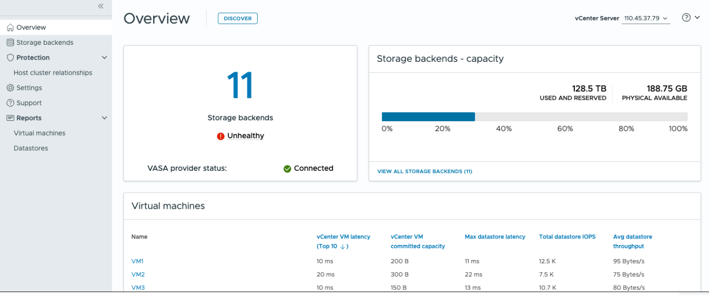

= Informationen zum ONTAP tools for VMware vSphere Dashboard
:allow-uri-read: 
:icons: font
:imagesdir: ../media/

[role="lead"]
Das Symbol für das ONTAP tools for VMware vSphere Plug-in im Bereich „Verknüpfungen“ des vCenter Clients auswählen, um das Dashboard zu öffnen, das den Status des Plug-ins, der Datenspeicher und der vCenter Serverdaten zusammenfasst.

Im Enhanced Linked Mode (ELM) wird das Dropdown-Menü „vCenter Server“ angezeigt.  Wählen Sie einen vCenter Server aus, um seine Daten anzuzeigen.  Das Dropdown-Menü ist in allen Listenansichten des Plug-Ins verfügbar. Wenn Sie auf einer Seite einen vCenter Server auswählen, bleibt dieser beim Wechseln der Registerkarten im Plug-In unverändert.

Auf der Übersichtsseite kann die Aktion *Erkennung* ausgeführt werden, um neu hinzugefügte oder aktualisierte Speicher-Backends, Hosts, Datenspeicher sowie Schutzstatus oder -beziehungen auf vCenter-Ebene zu erkennen. Die bedarfsgesteuerte Erkennung kann durchgeführt werden, ohne auf die geplante Erkennung warten zu müssen.

Wenn ein neuer Host zu einem geschützten Hostcluster hinzugefügt wird, ändern sich die Schutzeinstellungen auf *Teilweise geschützt*.

Um diesen Zustand zu beheben, *Clusterkonfiguration ändern* öffnen, den Host dem richtigen Standort (Quelle oder Ziel) zuweisen und *Ändern* auswählen.

NOTE: Die Schaltfläche *Discovery* ist nur dann aktiviert, wenn Sie über die erforderliche Privilege zur Durchführung der Discovery verfügen.

Nachdem die Ermittlungsanfrage übermittelt wurde, können Sie den Fortschritt der Aktion im Bereich „Letzte Aufgaben“ verfolgen.

Das Dashboard verfügt über mehrere Karten, die verschiedene Elemente des Systems anzeigen. Die folgende Tabelle zeigt die verschiedenen Karten und was sie darstellen.

|===

| *Karte* | *Beschreibung* 

| Status | Die Statuskarte zeigt die Anzahl der Speicher-Backends sowie den allgemeinen Zustand der Speicher-Backends und des VASA Provider an. Der Status der Speicher-Backends wird als *Healthy* angezeigt, wenn alle Speicher-Backends einen normalen Status haben, und als *Unhealthy*, wenn ein Speicher-Backend ein Problem hat (Status: Unknown/Nicht erreichbar/Beeinträchtigt). Wählen Sie das Tooltip aus, um die Statusdetails der Speicher-Backends zu öffnen. Sie können ein beliebiges Speicher-Backend für weitere Details auswählen. Der Link *Other VASA Provider states* zeigt den aktuellen Status des im vCenter Server registrierten VASA Provider an. 

| Storage Back-Ends – Kapazität | Diese Karte zeigt die aggregierte genutzte und verfügbare Kapazität aller Storage-Backends für die ausgewählte vCenter Server-Instanz an. Für ASA r2 Storage-Systeme werden die Kapazitätsdaten nicht angezeigt, da der Storage disaggregiert ist. 

| Virtual Machines | Diese Karte zeigt die Top 10 VMs, sortiert nach Leistungsmetrik. Die Überschrift kann ausgewählt werden, um die Top 10 VMs für die ausgewählte Metrik aufsteigend oder absteigend zu sortieren. Die auf der Karte vorgenommenen Sortier- und Filteränderungen bleiben erhalten, bis sie geändert oder der Browser-Cache geleert wird. 

| Datenspeicher | Diese Karte zeigt die zehn besten Datenspeicher, sortiert nach einer Leistungsmetrik. Die Überschrift kann ausgewählt werden, um die zehn besten Datenspeicher für die ausgewählte Metrik aufsteigend oder absteigend zu sortieren. Die auf der Karte vorgenommenen Sortier- und Filteränderungen bleiben erhalten, bis sie geändert oder der Browser-Cache geleert wird. Mit der Dropdown-Liste „Datenspeichertyp“ lässt sich der Datenspeichertyp auswählen: NFS, VMFS oder vVols. 

| ESXi-Host-Compliance-Karte | Diese Karte zeigt an, ob alle ESXi-Hosts (für das ausgewählte vCenter) die empfohlenen NetApp Host-Einstellungen nach Gruppe oder Kategorie einhalten. Sie können den Link *Empfohlene Einstellungen anwenden* auswählen, um die empfohlenen Einstellungen zu übernehmen. Sie können den Konformitätsstatus der Hosts auswählen, um die Liste der Hosts anzuzeigen. 
|===