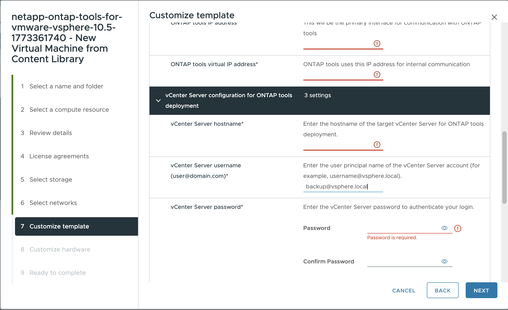

= ONTAP tools als Single-Node-Appliance bereitstellen
:allow-uri-read: 
:icons: font
:imagesdir: ../media/

[role="lead"]
ONTAP tools for VMware vSphere können als besonders kleine Einzelknoten-Appliance bereitgestellt werden, die NFS- und VMFS-Datenspeicher unterstützt. Der Bereitstellungsprozess dauert bis zu 45 Minuten.

.Bevor Sie beginnen
Wenn eine besonders kleine Einzelknotenkonfiguration bereitgestellt wird, ist eine Inhaltsbibliothek optional. Für Mehrknoten- oder HA-Bereitstellungen ist eine Inhaltsbibliothek erforderlich.

In VMware speichert eine Inhaltsbibliothek VM-Vorlagen, vApp-Vorlagen und andere Dateien. Die Verwendung einer Inhaltsbibliothek vereinfacht die Bereitstellung, da sie während der Vorlagenoperationen nicht von direktem Netzwerkzugriff abhängig ist.

Bevor eine Inhaltsbibliothek erstellt wird:

* Erstellen Sie die Inhaltsbibliothek auf einem gemeinsam genutzten Datenspeicher, damit alle Hosts im Cluster darauf zugreifen können.
* Die Bibliothek ist vor der Bereitstellung der ONTAP tools for VMware vSphere OVA zu erstellen.
* Die OVA-Vorlage bleibt nach der Bereitstellung in der Inhaltsbibliothek.

NOTE: Wenn eine spätere Aktivierung von HA vorgesehen ist, sollte die ONTAP tools VM in einem ESXi Cluster oder Ressourcenpool bereitgestellt werden, nicht direkt auf einem ESXi Host.

Zum Erstellen einer Bibliothek:

. Die ONTAP tools für VMware vSphere Binärdateien (_.ova_) und signierte Zertifikate sind von der  https://mysupport.netapp.com/site/products/all/details/otv10/downloads-tab["NetApp Support Website"^] herunterzuladen.
. Melden Sie sich beim vSphere Client an.
. Wählen Sie im vSphere Client-Menü die Option *Inhaltsbibliotheken*.
. *Erstellen* auswählen.
. Geben Sie einen Namen ein und erstellen Sie die Inhaltsbibliothek.
. Öffnen Sie die von Ihnen erstellte Bibliothek.
. *Aktionen* > *Element importieren* auswählen und die OVA-Datei importieren.

NOTE: Weitere Informationen finden sich unter  https://blogs.vmware.com/vsphere/2020/01/creating-and-using-content-library.html["Erstellen und Verwenden der Inhaltsbibliothek"].

NOTE: Vor der Bereitstellung den Distributed Resource Scheduler (DRS) des Clusters auf „Konservativ“ einstellen, um eine VM-Migration während der Installation zu verhindern.

ONTAP tools for VMware vSphere wird zunächst als Nicht-HA-Konfiguration bereitgestellt. Ab ONTAP tools 10.6 sind CPU-Hot-Add und Memory-Hot-Plug standardmäßig aktiviert. Um später auf HA zu skalieren, müssen diese Funktionen aktiviert werden.

.Schritte
. Laden Sie die ONTAP tools OVA-Datei und die signierten Zertifikate von der https://mysupport.netapp.com/site/products/all/details/otv10/downloads-tab["NetApp Support Website"^] herunter. Wenn die OVA-Datei bereits in die Inhaltsbibliothek importiert wurde, kann dieser Schritt übersprungen werden.
. Melden Sie sich beim vSphere-Server an.
. Zum Ressourcenpool, Cluster oder Host wechseln, auf dem die OVA bereitgestellt werden soll.
+

IMPORTANT: Die ONTAP tools VM darf nicht auf vVols Datenspeichern gespeichert werden, die sie verwaltet.

. Die OVA kann entweder aus der Bibliothek oder vom lokalen System bereitgestellt werden.
+
|===

| Aus dem lokalen System | Aus der Inhaltsbibliothek 

| a. Klicken Sie mit der rechten Maustaste, und wählen Sie *OVF-Vorlage bereitstellen...*. b. Wählen Sie die OVA-Datei aus der URL aus, oder navigieren Sie zu ihrem Speicherort, und wählen Sie dann *Weiter* aus. | a. Gehen Sie zu Ihrer Inhaltsbibliothek und wählen Sie das Bibliothekselement aus, das Sie bereitstellen möchten. b. Wählen Sie *Aktionen* > *Neue VM aus dieser Vorlage* 
|===
. In *Name und Ordner auswählen* den Namen und den Speicherort der virtuellen Maschine eingeben.
. Wählen Sie eine Computerressource aus und wählen Sie *Weiter*. Aktivieren Sie optional das Kontrollkästchen, um die bereitgestellte VM automatisch einzuschalten*.
. Überprüfen Sie die Details der Vorlage und wählen Sie *Weiter*.
. Lesen und akzeptieren Sie die Lizenzvereinbarung und wählen Sie *Weiter*.
. Wählen Sie den Speicher für die Konfiguration und das Festplattenformat aus und wählen Sie *Weiter*.
. Wählen Sie für jedes Quellnetzwerk das Zielnetzwerk aus und wählen Sie *Weiter*.
. Im Fenster *Vorlage anpassen* die erforderlichen Werte eingeben. 
+
[IMPORTANT]
====
Die Werte auf der Seite *Vorlage anpassen* sind für eine erfolgreiche Bereitstellung erforderlich.

Achten Sie besonders auf diese Felder:

** *Host name*: Geben Sie den Hostnamen der ONTAP tools VM ein. Ein gültiges Hostnamenformat ist zu verwenden.
** *ONTAP tools IP-Adresse*: Dies ist die primäre Managementoberfläche für den Zugriff auf ONTAP tools.
** *IPv4-Adresse*: Dies ist die Knoten-IP-Adresse, die für den Zugriff auf die Diagnoseshell und per SSH zur Fehlerbehebung und Wartung verwendet wird.

Wenn Sie DNS-Namen für den Host oder vCenter verwenden, muss sichergestellt sein, dass diese Namen im DNS korrekt aufgelöst werden.

====
+

NOTE: Der vCenter-Hostname ist der Name der vCenter Server-Instanz, auf der die ONTAP Tools Appliance bereitgestellt wird.

+
Wenn ONTAP tools in einer Zwei-vCenter Server-Topologie bereitgestellt werden, bei der die Appliance in einer vCenter Instanz gehostet wird und eine andere verwaltet, sollte für die vCenter Instanz, die ONTAP tools hostet, eine eingeschränkte Rolle zugewiesen werden. Eine dedizierte vCenter Benutzerin bzw. ein dedizierter Benutzer und eine Rolle mit ausschließlich den Berechtigungen, die für die OVF-Template-Bereitstellung erforderlich sind, sollten erstellt werden. Weitere Informationen finden sich unter link:../concepts/rbac-vcenter-use.html#vsphere-object-hierarchy["In ONTAP Tools für VMware vSphere 10 enthaltene Rollen"].

+
Für die von ONTAP tools verwaltete vCenter Instanz ist sicherzustellen, dass das vCenter Benutzerkonto über Administratorrechte verfügt.

+
** Hostnamen müssen Buchstaben (A-Z, a-z), Ziffern (0-9) und Bindestriche (-) enthalten. Für Dual Stack ist der Hostname anzugeben, der der IPv6-Adresse zugeordnet ist.
+

NOTE: Reines IPv6 wird nicht unterstützt. Der gemischte Modus wird mit einem VLAN unterstützt, das sowohl IPv6- als auch IPv4-Adressen enthält.

** Die IP-Adresse von ONTAP tools (ehemals Load Balancer) ist der externe Endpunkt für ONTAP tools Manager (`\https://<ip>:8443/virtualization/ui/`, API-Aufrufe und den Plug-in-Zugriff über die vCenter UI.
** Die virtuelle IP-Adresse der ONTAP tools (früher node interconnect) wird dem Kubernetes API (kube-api) Server zugewiesen und dient als virtuelle IP-Adresse für die Kubernetes Control Plane.
** Die IPv4-Adresse ist die Knotenverwaltungsadresse, die dem angegebenen Hostnamen zugeordnet ist und für den Diagnose-Shell- und SSH-Zugriff verwendet wird.

. Überprüfen Sie die Details im Fenster *Ready to Complete*, wählen Sie *Finish*.
+
Wenn der Bereitstellungsvorgang startet, wird der Fortschritt in der vSphere Taskleiste angezeigt.

. Wenn die automatische Einschaltung nicht ausgewählt wurde, die VM nach Abschluss des Vorgangs einschalten.

Der Installationsfortschritt lässt sich über die VM Webkonsole nachverfolgen.

Sollten Unstimmigkeiten im OVF-Formular auftreten, fordert ein Dialogfeld zur Korrekturmaßnahme auf. Mit der Tabulatortaste kann navigiert, die erforderlichen Änderungen vorgenommen und *OK* ausgewählt werden. Es stehen drei Versuche zur Behebung der Probleme zur Verfügung. Bestehen die Probleme nach drei Versuchen weiterhin, wird die Installation gestoppt und die Installation sollte auf einer neuen virtuellen Maschine erneut durchgeführt werden.
