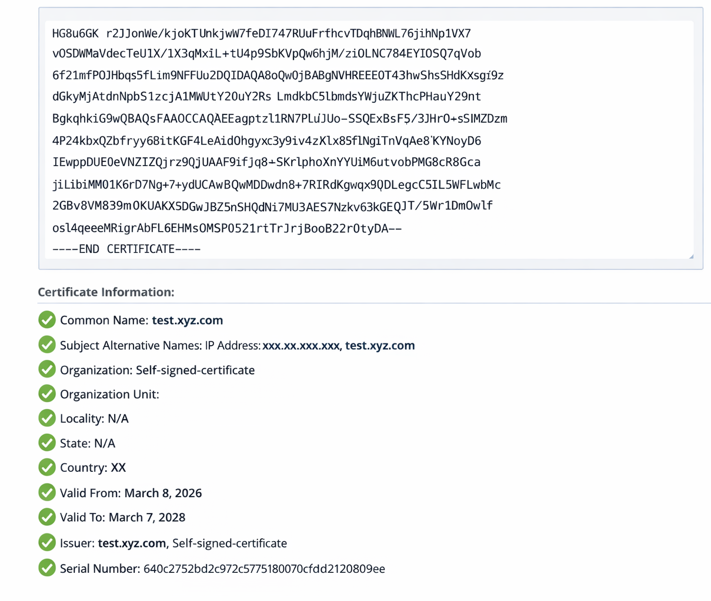

= Ändern Sie das Zertifikatvalidierungsflag in ONTAP tools
:allow-uri-read: 
:icons: font
:imagesdir: ../media/

[role="lead"]
Standardmäßig ist die Zertifikatsvalidierung für ONTAP Speicher-Backend-Zertifikate aktiviert. Bei Bedarf kann das Zertifikatsvalidierungs-Flag auf "false" gesetzt werden, um die SAN-Zertifikatsprüfung zu umgehen. Diese Einstellung gilt nicht für vCenter Server-Zertifikate.

.Bevor Sie beginnen
Sie benötigen die Anmeldeinformationen des Wartungsbenutzers.

.Schritte
. Melden Sie sich beim vCenter Server an.
. Die ONTAP tools VM suchen und die Webkonsole öffnen.
. Melden Sie sich mit den  `maint` Zugangsdaten an.
. Eingeben `1` um das Menü *Anwendungskonfiguration* auszuwählen.
. Geben Sie  `3` ein, um das Zertifikatvalidierungsflag zu ändern.
+
Die Wartungskonsole zeigt den Status des Zertifikatvalidierungsflags an und fordert Sie auf, ihn zu ändern.

. Geben Sie „y“ ein, um die Flagge umzuschalten, oder „n“, um abzubrechen.

Wenn die Zertifikatsvalidierung aktiviert ist, prüft ONTAP tools, ob alle Storage-Backends Zertifikate mit einem Subject Alternative Name (SAN) verwenden. Wenn ein Storage-Backend ein Zertifikat ohne SAN verwendet, kann die Validierung nicht aktiviert werden. Vor der Aktivierung dieser Option sollte überprüft werden, dass alle Storage-Backends SAN-basierte Zertifikate verwenden. Wenn die Option deaktiviert ist, überspringt ONTAP tools die Zertifikatsvalidierung für alle konfigurierten Storage-Backends.

[[verify-san-based-certificates-for-storage-backends]]
== SAN-basierte Zertifikate für Storage-Backends überprüfen

Um eine sichere Kommunikation und ordnungsgemäße Validierung zu gewährleisten, überprüfen Sie, ob alle Storage-Backends SAN-basierte Zertifikate verwenden:

. Prüfen Sie, ob das ONTAP-Managementzertifikat einen Subject Alternative Name (SAN)-Eintrag enthält.
. Bestätigen Sie, dass die SAN-Einträge mit der ONTAP-Management-IP-Adresse oder dem DNS-Namen oder beiden übereinstimmen.
. Stellen Sie sicher, dass die für die Onboarding von ONTAP verwendeten Details mit der IP-Adresse oder dem DNS-Namen im SAN-Eintrag des Zertifikats übereinstimmen.

Diese Schritte helfen, Probleme bei der Zertifikatsvalidierung zu vermeiden und das ONTAP-System sicher zu integrieren.

Das folgende Beispielzertifikat zeigt die dekodierten Informationen:

