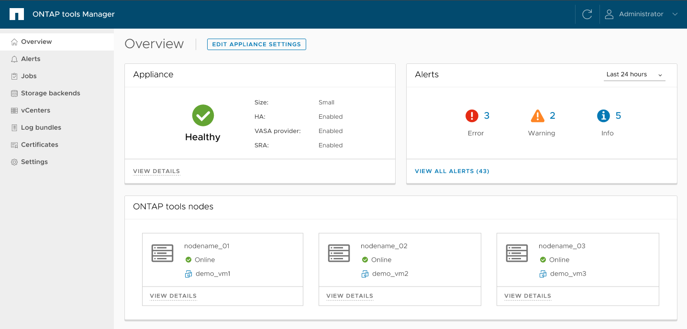

= Benutzeroberfläche von ONTAP Tools Manager
:allow-uri-read: 
:icons: font
:imagesdir: ../media/

[role="lead"]
ONTAP tools Manager ist eine webbasierte Konsole, mit der ONTAP tools für VMware vSphere verwaltet werden, einschließlich vCenter Server-Instanzen, Storage-Backends und Appliance-Konfigurationen wie Hochverfügbarkeit (HA) und Knotenskalierung. Es wird Mandantenfähigkeit unterstützt, sodass mehrere vCenter Server-Instanzen über eine einzige Oberfläche verwaltet werden können.

Der ONTAP Tools Manager bietet die folgenden Funktionen:

* Warnungen verwalten – Zeigen Sie von ONTAP tools for VMware vSphere generierte Warnungen an und filtern Sie sie.
* Speicher-Backends verwalten – Fügen Sie ONTAP Speichercluster hinzu, verwalten Sie sie und ordnen Sie sie global vCenter Server-Instanzen zu.
* vCenter Server-Instanzen verwalten – Fügen Sie vCenter Server-Instanzen innerhalb der ONTAP Tools hinzu und verwalten Sie sie.
* Jobs überwachen – Überwachung und Debugging asynchroner Jobs, die sowohl über die ONTAP tools Plug-in-Oberfläche als auch die ONTAP tools Manager-Oberfläche initiiert wurden. Jobs können nach Zeitraum gefiltert, die Seitengröße angepasst und Jobdetails, einschließlich Fehlern und Unteraufgaben, angezeigt werden. Der Fehlerstatus kann ausgewählt werden, um die Fehlerdetails anzuzeigen. Bei Jobs mit Unteraufgaben kann die Zeile erweitert werden, um Beschreibungen und Status anzuzeigen. Für Unterjobs kann das Drilldown des Jobs verwendet werden, um die Details anzuzeigen.
* Laden Sie Protokollpakete herunter – Sammeln Sie Protokolldateien zur Fehlerbehebung bei ONTAP tools for VMware vSphere.
* Zertifikate verwalten – Ersetzen Sie das selbstsignierte Zertifikat durch ein benutzerdefiniertes CA-Zertifikat und erneuern oder aktualisieren Sie Zertifikate für VASA Provider und ONTAP Tools.
* Passwörter zurücksetzen – Ändern Sie das Passwort für den VASA-Anbieter und SRA.
* Appliance-Einstellungen verwalten – Konfigurieren Sie die ONTAP -Tools-Appliance, einschließlich der Aktivierung von HA und der Skalierung der Knotengrößen.

Um auf ONTAP tools Manager zuzugreifen,  `\https://<ONTAPtoolsIP>:8443/virtualization/ui/`im Browser starten und sich mit den ONTAP tools for VMware vSphere Administratoranmeldeinformationen anmelden, die während der Bereitstellung angegeben wurden.

|===
| *Karte* | *Beschreibung* 

| Gerätekarte | Die Appliance-Karte zeigt den Gesamtstatus der ONTAP Tools-Appliance, Konfigurationsdetails und den Status aktivierter Dienste.  Um weitere Informationen anzuzeigen, wählen Sie den Link *Details anzeigen*.  Wenn Sie eine Geräteeinstellung ändern, werden auf der Karte der Auftragsstatus und die Details angezeigt, bis die Änderung abgeschlossen ist. 

| Warnkarte | Die Warnmeldungskarte zeigt ONTAP tools Warnmeldungen, kategorisiert nach Typ, einschließlich Warnungen auf HA Node-Ebene. Detaillierte Warnmeldungen sind über den Link „Anzahl“ einsehbar, der zur Warnmeldungsseite führt, gefiltert nach dem ausgewählten Warnmeldungstyp. 

| vCenters-Karte | Die vCenters-Karte zeigt den Integritätsstatus aller von ONTAP -Tools verwalteten vCenter Server-Instanzen.  Sie können Details zu jedem vCenter anzeigen, indem Sie den entsprechenden Link auswählen, der zu einer Seite mit weiteren Informationen zur ausgewählten Instanz führt. 

| Speicher-Backends-Karte | Die Karte „Storage-Backends“ zeigt den Integritäts- und Konnektivitätsstatus aller in ONTAP -Tools konfigurierten ONTAP -Speichercluster an.  Sie können Details zu jedem Speicher-Backend anzeigen, indem Sie den entsprechenden Link auswählen, der zu einer Seite mit weiteren Informationen zum ausgewählten Cluster führt. 

| Karte der ONTAP-Tools-Knoten | Die ONTAP tools Knotenkarte zeigt alle Knoten im Appliance an, einschließlich Node-Name, VM-Name, Status und Netzwerkinformationen. *Details anzeigen* zeigt weitere Details zu einem bestimmten Knoten an. [HINWEIS] In einer Nicht-HA-Konfiguration erscheint nur ein Knoten. In einer HA-Konfiguration erscheinen drei Knoten. 
|===