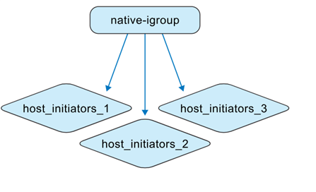
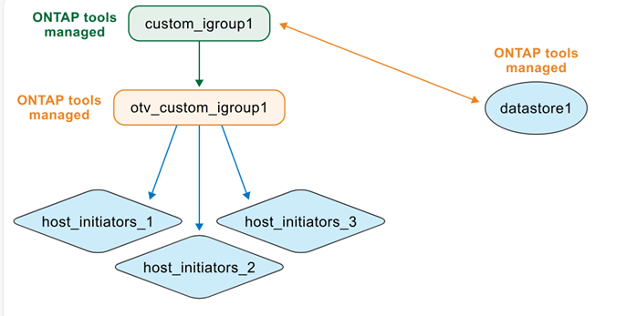

= Wie ONTAP tools igroups verwaltet
:allow-uri-read: 
:icons: font
:imagesdir: ../media/

[role="lead"]
Wenn Sie sowohl ONTAP tools-VMs als auch ONTAP-Speichersysteme verwalten, ist es wichtig, das Verhalten von Initiatorgruppen zu verstehen, insbesondere beim Verschieben von Datenspeichern aus Umgebungen, die nicht von ONTAP tools verwaltet werden, in solche, die es werden. Diese Seite erläutert, wie ONTAP tools für VMware vSphere Initiatorgruppen darstellt und verwaltet. Es handelt sich um konzeptionelle Informationen zum Verständnis der Verhaltensunterschiede zwischen früheren Versionen und dem aktuellen verschachtelten Initiatorgruppenmodell.

Ab ONTAP tools for VMware vSphere 10.4 werden ONTAP- und vCenter-Objekte automatisch erstellt und verwaltet, wodurch die Datenspeicherverwaltung in VMware-Rechenzentrumsumgebungen vereinfacht wird. Ab ONTAP tools for VMware vSphere 10.5 P2 werden migrierte Initiatorgruppen zudem automatisch gelöscht, sobald sie nicht mehr verwendet werden.

[[quick-behavior-summary]]
== Kurze Verhaltenszusammenfassung

* ONTAP Tools-verwaltete VMFS-Datenspeicher verwenden verschachtelte Initiatorgruppen: eine übergeordnete Initiatorgruppe pro Datenspeicherkontext und untergeordnete Initiatorgruppen pro Host.
* LUN-Zuordnungen werden auf untergeordnete Initiatorgruppen angewendet.
* Benutzerdefinierte übergeordnete Initiatorgruppen können datenspeicherübergreifend wiederverwendet werden.
* Migrierte Initiatorgruppen aus ONTAP tools 9.x können nicht wiederverwendet werden.

[[igroup-contexts]]
== Initiatorgruppen-Kontexte

ONTAP tools for VMware vSphere verarbeitet Initiatorgruppen in zwei Kontexten.

.Von Nicht- ONTAP -Tools verwaltete igroups
Als Speicheradministrator können Sie auf dem ONTAP-System Initiatorgruppen als flache oder verschachtelte Strukturen erstellen. Die folgende Abbildung zeigt eine flache Initiatorgruppe, die direkt in ONTAP erstellt wurde.

.Von ONTAP -Tools verwaltete igroups
Wenn Sie Datenspeicher erstellen, erstellt ONTAP tools for VMware vSphere Initiatorgruppen in einer verschachtelten Struktur.

Wenn beispielsweise Datastore1 erstellt und auf den Hosts 1, 2 und 3 gemountet wird und ein neuer Datastore (Datastore2) erstellt und auf den Hosts 3, 4 und 5 gemountet wird, verwenden ONTAP -Tools die igroup auf Hostebene für eine effiziente Verwaltung erneut.

image:../media/otv-managed.png["ONTAP -Tools verwalteten igroup"]

image:../media/otv-managed2.png["Von ONTAP -Tools verwaltete igroup mit wiederverwendeter untergeordneter igroup"]

[[naming-behavior]]
== Benennungsverhalten

Wenn Sie einen Datenspeicher erstellen und das Feld Initiatorgruppe leer lassen, erstellt ONTAP tools eine standardmäßige verschachtelte Initiatorgruppe-Struktur.

* Namensmuster der übergeordneten Initiatorgruppe: `otv_<vcguid>_<host_parent_datacenterMoref>_<datastore_name>`
* Namensmuster für untergeordnete Initiatorgruppen: `otv_<hostMoref>_<vcguid>`

Die ONTAP Benutzeroberfläche der ONTAP-Systeme zeigt die Beziehung zwischen übergeordneten und untergeordneten Initiatorgruppen im Feld *Übergeordnete Initiatorgruppe* an.

[[behavior-by-scenario]]
== Verhalten je nach Szenario

[cols="25,25,25,25"]
|===
| Szenario | Elterngruppenverhalten der Initiatorgruppe | Verhalten von untergeordneten Initiatorgruppen | LUN-Zuordnung und -Sichtbarkeit 

| Datenspeicher mit Standard-Initiatorgruppe-Einstellung erstellt | Eine standardmäßige, von ONTAP tools verwaltete übergeordnete Initiatorgruppe wird erstellt. | Bei Bedarf werden untergeordnete Initiatorgruppen auf Hostebene erstellt. | LUNs werden untergeordneten Initiatorgruppen zugeordnet. Der Datenspeicher wird im vCenter Server-Inventar angezeigt. 

| Datenspeicher mit benutzerdefiniertem Initiatorgruppen-Namen erstellt | Es wird eine benutzerdefinierte übergeordnete Initiatorgruppe mit dem angegebenen Namen erstellt. | Vorhandene untergeordnete Initiatorgruppen auf Hostebene werden wiederverwendet, wenn sich Hosts überschneiden. | Die neue Datenspeicher-LUN wird der wiederverwendeten oder neu erstellten untergeordneten Initiatorgruppe zugeordnet. Der Datenspeicher wird im vCenter Server angezeigt. 

| Vorhandene benutzerdefinierte Initiatorgruppe wird bei der Datenspeichererstellung wiederverwendet | Eine vorhandene benutzerdefinierte übergeordnete Initiatorgruppe wird ausgewählt und wiederverwendet. | Untergeordnete Initiatorgruppen werden basierend auf der Host-Mitgliedschaft wiederverwendet oder erweitert. | Die neue Datenspeicher-LUN wird über die zugehörige untergeordnete Initiatorgruppe zugeordnet. Der Datenspeicher wird im vCenter Server angezeigt. 

| Datenspeicher und Initiatorgruppe wurden nativ in ONTAP und vCenter erstellt und anschließend von ONTAP tools erkannt. | ONTAP tools erstellt eine übergeordnete Initiatorgruppe in seinem Verwaltungskontext und behält den ursprünglichen Initiatorgruppenamen bei. | ONTAP tools benennt die ursprüngliche Initiatorgruppe mit dem  `otv_` Präfix um und stellt sie als untergeordnete Initiatorgruppe in der Hierarchie dar. | Die Initiatorzuordnungen bleiben unverändert. Nur die Datenspeichern zugeordneten Initiatorgruppen werden während der Erkennung konvertiert. 
|===

[[custom-igroup-reuse-and-api-behavior]]
== Benutzerdefinierte Initiatorgruppen-Wiederverwendung und API-Verhalten

In der Benutzeroberfläche der ONTAP tools können Sie beim Erstellen eines Datenspeichers eine vorhandene benutzerdefinierte übergeordnete Initiatorgruppe aus der Dropdown-Liste wiederverwenden.

Das gleiche Verhalten wird über die API unterstützt. Um eine vorhandene Initiatorgruppe bei der Datenspeichererstellung wiederzuverwenden, geben Sie die Initiatorgruppen-UUID in der API-Nutzlast an.

NOTE: Nur benutzerdefinierte Initiatorgruppen können wiederverwendet werden. Migrierte Initiatorgruppen aus ONTAP tools 9.x können nicht wiederverwendet werden und werden ab ONTAP tools 10.5 P2 automatisch gelöscht, sobald sie nicht mehr verwendet werden.

[[native-to-managed-conversion-view]]
== Ansicht zur Konvertierung von nativ zu verwaltet

Wenn Sie die Initiatorgruppe und den Datenspeicher direkt in ONTAP-Systemen und VMware-Umgebungen erstellen, werden diese Objekte von den ONTAP tools zunächst nicht verwaltet. Dies führt zu einer flachen Initiatorgruppenstruktur.

image:../media/vmfsds-native.png["Datastore und igroup nativ erstellt"]

Nach der Datenspeichererkennung identifiziert und registriert ONTAP tools die datenspeicherzugeordneten Initiatorgruppen und stellt sie anschließend in einem verschachtelten Modell dar. Die übergeordnete Initiatorgruppe wird auf Datenspeicherebene abgebildet, die bestehende Initiatorgruppe wird mit dem  `otv_` Präfix als untergeordnete Initiatorgruppe umbenannt, und die Initiatorzuordnungen bleiben unverändert.

ONTAP tools for VMware vSphere erkennen oder verwalten keine Initiatorgruppen, die in ONTAP-Systemen erstellt wurden, aber keinem Datenspeicher zugeordnet oder mit ONTAP tools verknüpft sind. Während der Erkennung konvertieren ONTAP tools nur die Initiatorgruppen, die erkannten Datenspeichern zugeordnet sind; andere Initiatorgruppen bleiben unverwaltet.

[[reuse-of-discovered-native-igroups]]
== Wiederverwendung entdeckter nativer Initiatorgruppen

Nachdem ONTAP tools eine erkannte native Initiatorgruppe verwaltet, steht diese Initiatorgruppe in der Dropdown-Liste für benutzerdefinierte Initiatorgruppennamen zur Erstellung von Datenspeichern zur Verfügung.

Die neue Datastore-LUN wird der normalisierten Child-Initiatorgruppe zugeordnet, zum Beispiel  `otv_NativeIgroup1`.

ONTAP tools for VMware vSphere erkennt oder verwendet keine Initiatorgruppen, die in ONTAP-Systemen erstellt wurden, die nicht von ONTAP tools verwaltet werden oder nicht mit einem Datenspeicher verknüpft sind.
