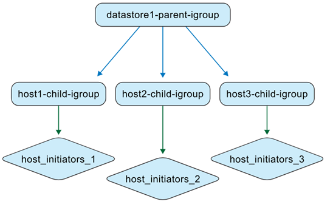

= Verstehen Sie die von ONTAP -Tools verwalteten igroups
:allow-uri-read: 
:icons: font
:imagesdir: ../media/

[role="lead"]
Wenn Sie sowohl VMs mit ONTAP -Tools als auch ONTAP Speichersysteme verwalten, ist es wichtig zu verstehen, wie sich igroups verhalten, insbesondere beim Verschieben von Datenspeichern aus Umgebungen, die nicht mit ONTAP -Tools verwaltet werden, in Umgebungen, die mit ONTAP-Tools verwaltet werden.  In diesem Abschnitt wird erläutert, wie igroups während dieses Vorgangs aktualisiert werden.

ONTAP tools for VMware vSphere 10.4 und höhere Versionen erstellen und verwalten automatisch ONTAP und vCenter-Objekte, um die Datenspeicherverwaltung in VMware-Rechenzentrumsumgebungen zu vereinfachen.

ONTAP tools for VMware vSphere interpretieren igroups in zwei verschiedenen Kontexten:

.Von Nicht- ONTAP -Tools verwaltete igroups
Als Speicheradministrator können Sie igroups auf dem ONTAP -System als flache oder verschachtelte Strukturen erstellen.  Die Abbildung zeigt eine flache igroup, die im ONTAP -System erstellt wurde.

image:../media/non-otv-managed.png["Von Nicht- ONTAP -Tools verwaltete igroup"]

.Von ONTAP -Tools verwaltete igroups
Wenn Sie Datenspeicher erstellen, erstellen ONTAP tools for VMware vSphere automatisch igroups mithilfe einer verschachtelten Struktur für eine einfachere LUN-Zuordnung.

Wenn beispielsweise Datastore1 erstellt und auf den Hosts 1, 2 und 3 gemountet wird und ein neuer Datastore (Datastore2) erstellt und auf den Hosts 3, 4 und 5 gemountet wird, verwenden ONTAP -Tools die igroup auf Hostebene für eine effiziente Verwaltung erneut.

image:../media/otv-managed2.png["Von ONTAP -Tools verwaltete igroup mit wiederverwendeter untergeordneter igroup"]

Hier sind einige Fälle für ONTAP tools for VMware vSphere unterstützte igroups.

*Wenn Sie einen Datenspeicher mit Standard-Igroup-Einstellungen erstellen*

Wenn Sie einen Datenspeicher erstellen und das Feld „igroup“ leer lassen (Standardeinstellung), generieren ONTAP -Tools automatisch eine verschachtelte igroup-Struktur für diesen Datenspeicher.  Die übergeordnete igroup auf Datenspeicherebene wird nach folgendem Muster benannt: otv_<vcguid>_<host_parent_datacenterMoref>_<datastore_name>.  Jede untergeordnete igroup auf Hostebene folgt dem Muster: otv_<hostMoref>_<vcguid>.  Sie können die Zuordnung zwischen übergeordneten (Datenspeicherebene) und untergeordneten (Hostebene) igroups im Abschnitt *Parent Initiator Group* der ONTAP Speicherschnittstelle anzeigen.

Beim Ansatz mit verschachtelten igroups werden LUNs nur den untergeordneten igroups zugeordnet. Das vCenter Server-Inventar zeigt dann den neuen Datenspeicher an.

*Wenn Sie einen Datenspeicher mit einem benutzerdefinierten igroup-Namen erstellen*

Während der Datenspeichererstellung in ONTAP -Tools können Sie einen benutzerdefinierten Igroup-Namen eingeben, anstatt ihn aus der Dropdown-Liste auszuwählen. Anschließend erstellen die ONTAP -Tools eine übergeordnete igroup auf Datenspeicherebene mit dem von Ihnen angegebenen Namen. Wenn derselbe Host für mehrere Datenspeicher verwendet wird, wird die vorhandene (untergeordnete) igroup auf Hostebene wiederverwendet. Infolgedessen wird die LUN für den neuen Datenspeicher dieser vorhandenen untergeordneten Igroup zugeordnet, die jetzt möglicherweise mit mehreren übergeordneten Igroups verknüpft ist (eine für jeden Datenspeicher). Sie können den neuen Datenspeicher mit dem benutzerdefinierten Igroup-Namen in der vCenter Server-Schnittstelle sehen.

*Wenn Sie den Igroup-Namen während der Datenspeichererstellung wiederverwenden*

Wenn Sie einen Datenspeicher mithilfe der Benutzeroberfläche der ONTAP -Tools erstellen, können Sie eine vorhandene benutzerdefinierte übergeordnete igroup aus der Dropdown-Liste auswählen.  Nachdem Sie die übergeordnete igroup zum Erstellen eines anderen Datenspeichers wiederverwendet haben, zeigt die Benutzeroberfläche des ONTAP -Systems diese Zuordnung an.  Der neue Datenspeicher wird auch in der Benutzeroberfläche von vCenter Server angezeigt.

Dieser Vorgang kann auch mithilfe der API durchgeführt werden.  Um eine vorhandene Igroup während der Datenspeichererstellung wiederzuverwenden, geben Sie die Igroup-UUID in der Nutzlast der API-Anforderung an.

*Wenn Sie einen Datastore und eine igroup nativ von ONTAP und vCenter erstellen*

Wenn Sie die igroup und den Datenspeicher direkt in ONTAP -Systemen und VMware-Umgebungen erstellen, verwalten die ONTAP Tools diese Objekte zunächst nicht.  Dadurch entsteht eine flache Igroup-Struktur.

image:../media/vmfsds-native.png["Datastore und igroup nativ erstellt"]

Um einen vorhandenen Datenspeicher und eine vorhandene igroup mit ONTAP Tools zu verwalten, sollten Sie eine Datenspeichererkennung durchführen.  ONTAP -Tools identifizieren und registrieren den Datenspeicher und die Igroup und konvertieren sie in eine verschachtelte Struktur in ihrer Datenbank.  Eine neue übergeordnete Igroup wird mit dem benutzerdefinierten Namen erstellt, während die vorhandene Igroup mit dem Präfix „otv_“ umbenannt wird und zur untergeordneten Igroup wird.  Die Initiatorzuordnungen bleiben unverändert.  Während der Erkennung werden nur den Datenspeichern zugeordnete Igroups konvertiert.  Danach sieht die Igroup-Struktur wie in der folgenden Abbildung aus.

image:../media/otv-ds.png["Datastore und igroup werden von ONTAP -Tools verwaltet"]

Nachdem Sie die Datenspeichererkennung in ONTAP -Tools ausgeführt haben, konvertieren ONTAP Tools die flache Igroup in eine verschachtelte Struktur. ONTAP -Tools verwalten dann die igroup und benennen sie mit dem Präfix „otv_“ um. Die LUN bleibt während des gesamten Vorgangs derselben Igroup zugeordnet.

*Wie ONTAP -Tools nativ erstellte igroups wiederverwenden*

Sie können einen Datenspeicher in ONTAP -Tools mithilfe einer Igroup erstellen, die zuerst in ONTAP Systemen erstellt wurde, nachdem ONTAP Tools sie verwaltet haben. Diese Igroups werden in der Dropdown-Liste mit den benutzerdefinierten Initiatorgruppennamen angezeigt. Die neue LUN für den Datenspeicher wird dann der entsprechenden normalisierten untergeordneten Igroup zugeordnet, beispielsweise „otv_NativeIgroup1“.

ONTAP tools for VMware vSphere erkennen oder verwenden keine im ONTAP System erstellten Igroups, die nicht von ONTAP Tools verwaltet oder mit einem Datenspeicher verknüpft werden.
