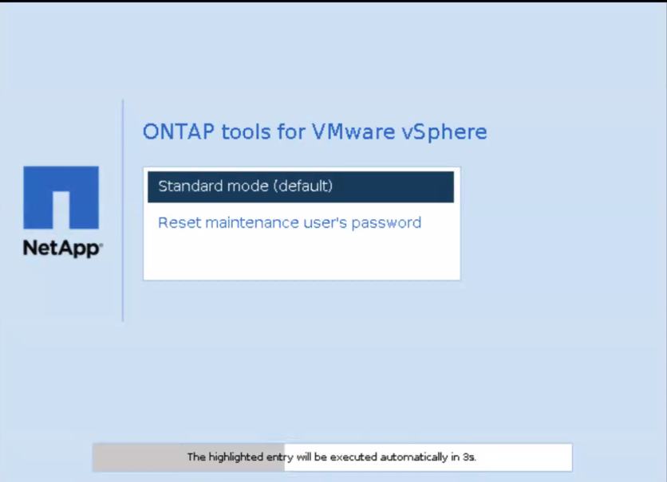

= Passwort der ONTAP tools for VMware vSphere Wartungskonsole zurücksetzen
:allow-uri-read: 
:icons: font
:imagesdir: ../media/

[role="lead"]
Beim Neustart des Gastbetriebssystems wird im GRUB-Menü eine Option zum Zurücksetzen des Benutzerpassworts der Wartungskonsole angezeigt. Mit dieser Option lässt sich das Passwort auf der VM aktualisieren. Nach dem Zurücksetzen des Passworts startet die VM neu. In einer HA-Bereitstellung aktualisiert das System nach dem Neustart das Passwort auf den beiden anderen VMs automatisch.

NOTE: Für eine ONTAP tools for VMware vSphere HA-Bereitstellung ist das Benutzerkennwort der Wartungskonsole auf dem ONTAP tools Management-Node (node1) zu ändern.

.Schritte
. Melden Sie sich bei Ihrem vCenter-Server an
. Klicken Sie mit der rechten Maustaste auf die VM und wählen Sie *Ein/Aus* > *Gastbetriebssystem neu starten*. Während des Systemneustarts wird der folgende Bildschirm angezeigt: 
+
Sie haben fünf Sekunden Zeit, eine Option auszuwählen. Drücken Sie eine beliebige Taste, um den Countdown zu stoppen und das GRUB-Menü anzuhalten.

. Wählen Sie die Option *Passwort des Wartungsbenutzers zurücksetzen*. Die Wartungskonsole wird geöffnet.
. Geben Sie in der Konsole das neue Passwort ein und bestätigen Sie es.  Sie haben drei Versuche.  Das System startet neu, nachdem Sie das neue Passwort erfolgreich eingegeben haben.
. Drücken Sie die *Eingabetaste*, um fortzufahren.  Das System aktualisiert das Passwort auf der VM.

NOTE: Das gleiche GRUB-Menü erscheint beim Einschalten der virtuellen Maschine. Die Option zum Zurücksetzen des Passworts ist nur zusammen mit *Restart Guest OS* zu verwenden.
