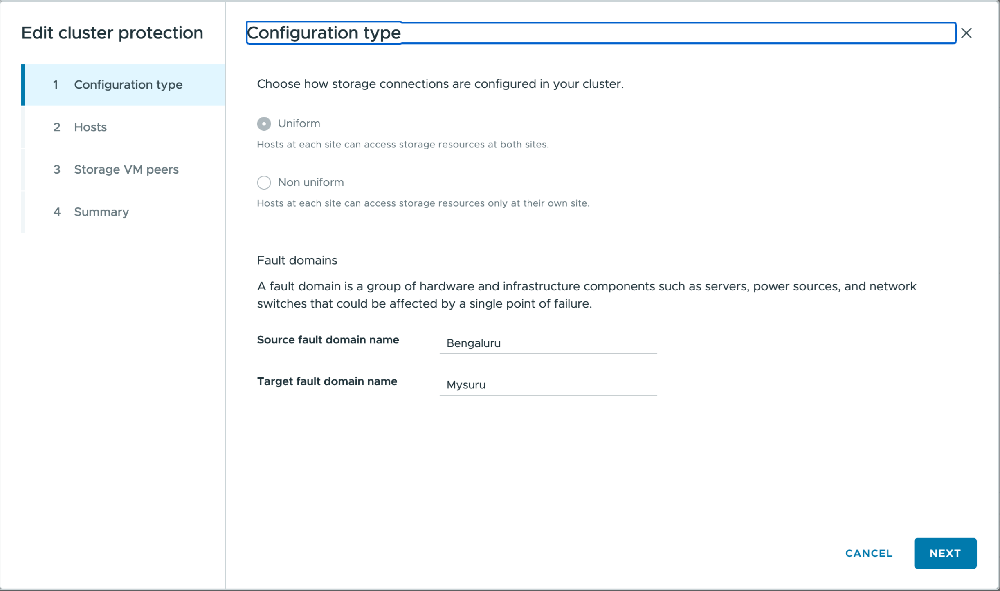

= Cluster für den Datenspeicherschutz mit ONTAP tools konfigurieren
:allow-uri-read: 
:icons: font
:imagesdir: ../media/

[role="lead"]
Mit ONTAP tools for VMware vSphere lassen sich Clusterkonfigurationseinstellungen (Host-zu-Speicher-Nähe) konfigurieren, wodurch ein effizienter Schutz von Datenspeichern und ein reibungsloses Failover-Management für die virtualisierte Umgebung ermöglicht werden.

.Bevor Sie beginnen
* Überprüfen Sie, ob Sie über Administratorrechte in vSphere verfügen.
* Die Clusterkonfigurationseinstellungen sind für uniforme und nicht-uniforme Konfigurationen anwendbar, während die Zugriffseinstellungen nur für Beziehungen vom Typ AFD anwendbar sind.

.Schritte
. Im vSphere Client mit der rechten Maustaste auf den Host-Cluster klicken und *Clusterschutz konfigurieren* auswählen.
+

NOTE: Wenn der Cluster bereits über eine Clusterkonfiguration verfügt, ermöglicht diese Option das Bearbeiten der bestehenden Konfiguration.

. Im Fenster *Konfigurationstyp*:
+
.. *Uniform* auswählen, damit Hosts in beiden Fehlerdomänen auf Speicherressourcen an beiden Standorten zugreifen können. Eine Fehlerdomäne ist eine Gruppe von Hardware- und Infrastrukturkomponenten. Jeder Host ist einer Fehlerdomäne an beiden Standorten zuzuordnen.
.. *Nicht einheitlich* auswählen, um Hosts an jedem Standort den Zugriff auf Speicher ausschließlich am jeweiligen Standort zu ermöglichen. Hosts entsprechend den Fehlerdomänen zuweisen.
.. Geben Sie die Namen der Fehlerdomänen ein. Standardmäßig lauten die Namen „Standort A“ und „Standort B“. Diese Werte können bearbeitet werden. Die Standortnamen sind den Quell- und Zielfehlerdomänen zugeordnet. Die Benutzeroberfläche prüft die Eingaben während der Eingabe und zeigt Meldungen für nicht unterstützte Zeichen oder Werte an, die die Zeichenbegrenzung überschreiten.
+

NOTE: Der Konfigurationstyp kann nach der Festlegung nicht mehr geändert werden. Zum Ändern des Konfigurationstyps ist die Clusterkonfiguration zu löschen und eine neue mit den gewünschten Einstellungen zu erstellen.

. Wählen Sie *Weiter*.
. Im Fenster *Hosts* wird jeder Host entweder der Quell-Fehlerdomäne oder der Ziel-Fehlerdomäne zugewiesen. Alle Hosts müssen zugewiesen werden, und ein Host kann nicht beiden Standorten angehören. Die im Assistenten angezeigten Standortnamen sind die Namen der Quell- und Ziel-Fehlerdomäne. Die Schaltfläche *Weiter* ist aktiviert, nachdem alle Hosts zugewiesen wurden.
. Wählen Sie *Weiter*.
. Auf der Seite *Storage SVM peers* wird jeder SVM der entsprechende Standort zugewiesen. Es können mehrere SVM Peers zugewiesen werden, jedoch muss mindestens einer jedem Standort zugeordnet sein. Wird einer SVM ein Standort zugewiesen, wird ihre Peer SVM automatisch dem gegenüberliegenden Standort zugeordnet.
. Wählen Sie *Weiter*.
. Die Seite *Zusammenfassung* wird angezeigt. Die Clusterkonfigurationseinstellungen für die jeweiligen Fehlerdomänen sind ersichtlich.
. *Erstellen* auswählen, um die Konfiguration anzuwenden.
. Anzeigen oder Bearbeiten einer bestehenden Cluster-Schutzkonfiguration:
+
.. Zur ONTAP tools Plug-in-Ansicht wechseln.
.. Zu *Schutz* > *Cluster protection configuration* navigieren.
.. Den Cluster auswählen, um die aktuelle Konfiguration anzuzeigen.
.. Klicken Sie auf die drei Punkte und wählen Sie *Bearbeiten*, um die Konfiguration zu ändern. Der Assistent zeigt die aktuellen Einstellungen zur Bearbeitung an.
+

.Ergebnis
Die Konfiguration wird angewendet und kann im ONTAP tools Plugin angezeigt oder bearbeitet werden.
