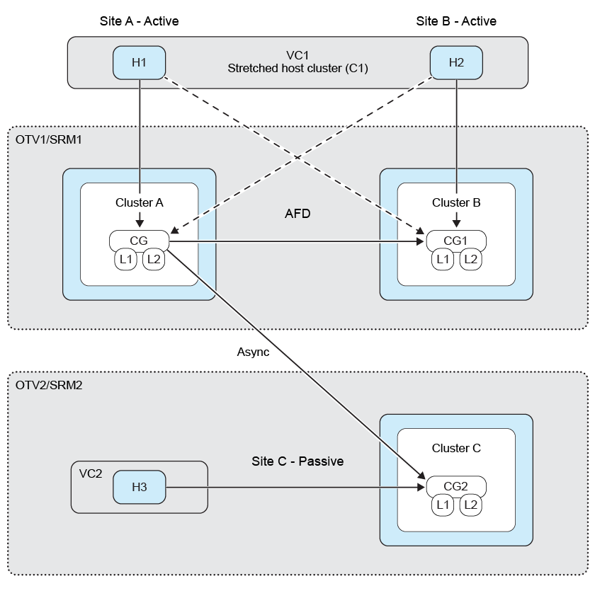
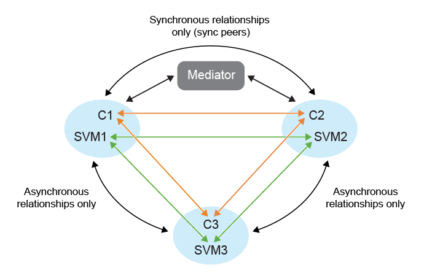

= Fan-out-Schutz in ONTAP tools
:allow-uri-read: 
:icons: font
:imagesdir: ../media/

[role="lead"]
Mit Fan-Out-Schutz wird eine Konsistenzgruppe über zwei Ziel-ONTAP-Cluster geschützt. ONTAP tools hält die synchrone Beziehung über die Workflows zum Erstellen, Bearbeiten und Löschen des SnapMirror Active Sync-Schutzes aufrecht, während VMware Live Site Recovery die asynchrone Beziehung über Failover- und Reprotect-Workflows aufrechterhält.

NOTE: Fan-Out wird für SVM-Benutzer nicht unterstützt.

Um den Fan-Out-Schutz einzurichten, führen Sie ein Peering der drei Site-Cluster und SVMs durch.

Das folgende Diagramm zeigt die Fan-Out-Schutzkonfiguration: 

Beispiel:

Wenn:

* Die Konsistenzgruppe der Quelle befindet sich auf Cluster c1 und SVM svm1
* Die erste Ziel-Konsistenzgruppe befindet sich auf Cluster c2 und SVM svm2 und
* Die zweite Ziel-Konsistenzgruppe befindet sich auf Cluster c3 und SVM svm3

Dann,

* Der Cluster-Peering auf dem Quell-ONTAP-Cluster ist (C1, C2) und (C1, C3).
* Der Cluster-Peering auf dem ersten Ziel-ONTAP-Cluster ist (C2, C1) und (C2, C3)
* Der Cluster-Peering auf dem zweiten Ziel-ONTAP-Cluster sind (C3, C1) und (C3, C2).
* SVM-Peering auf Quell-SVM wird (svm1, svm2) und (svm1, svm3) sein.
* SVM-Peering auf der ersten Ziel-SVM wird (svm2, svm1) und (svm2, svm3) und sein
* Das SVM-Peering auf der zweiten Ziel-SVM ist (svm3, svm1) und (svm3, svm2).

.Schritte
. Wählen Sie einen neuen Platzhalterdatenspeicher aus. Die Auswahlkriterien für den Platzhalterdatenspeicher im Rahmen des phasenweisen Schutzes lauten:
+
** Platzieren Sie den Platzhalter-Datenspeicher nicht im Hostcluster, den Sie schützen.
** Wenn Sie den Platzhalterdatenspeicher in den Hostcluster einbinden müssen, fügen Sie ihn der VMware Live Site Recovery Appliance hinzu, bevor Sie SnapMirror active sync-Schutz einrichten. Mit dieser Konfiguration können Sie den Platzhalterdatenspeicher vom Schutz ausnehmen.
+
Weitere Informationen finden Sie unter https://techdocs.broadcom.com/us/en/vmware-cis/live-recovery/site-recovery-manager/8-8/site-recovery-manager-administration-8-8/about-placeholder-virtual-machines/configure-a-placeholder-datastore.html["Einen Platzhalter-Datenspeicher auswählen"]

. Fügen Sie Datenspeicher zum Hostclusterschutz hinzu, indem Sie link:../protect/protect-multiple-ds.html["Datenspeicher in einem Cluster schützen"] folgen. Fügen Sie sowohl asynchrone als auch synchrone Richtlinientypen hinzu.

